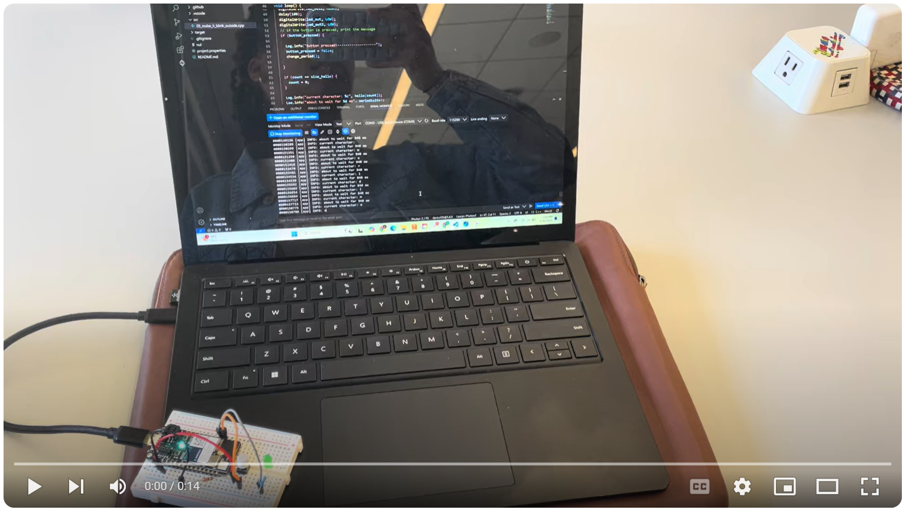

# DES INV 202 Weekly Progress Reports
Lauryn Wright's Journey through Technology Design Foundations 

## Table of Contents

| &emsp; 8/30 - 9/26 &emsp; | &emsp; 9/27 - 10/24 &emsp; | &emsp; 10/25 - 11/21 &emsp; |
|:-------------------------:|:--------------------------:|:---------------------------:|
| [week 1](README.md#week-1-report-1) | [week 5](README.md#week-5-report-5) | [week 9](README.md#week-9-report-9)    |
| [week 2](README.md#week-2-report-2) | [week 6](README.md#week-6-report-6) | [week 10](README.md#week-10-report-10) |
| [week 3](README.md#week-3-report-3) | [week 7](README.md#week-7-report-7) | [week 11](README.md#week-11-report-11) |
| [week 4](README.md#week-4-report-4) | [week 8](README.md#week-8-report-8) | [week 12](README.md#week-12-report-12) |

---
## Week 12: Report 12 #
### 11/15/2024 - 11/21/2024

---
## Week 11: Report 11 #
### 11/08/2024 - 11/14/2024

This week, I completed my report for project 3. To accomplish that, I needed to create several diagrams and synthesize some information into digestable representations. I created a system architecture diagram displaying the components interacting in my experiment 5 agent flow, and I created a process diagram illustrating the interactions and flow of information between each component. In addition to the diagrams, I created a table with the baseline questions and target responses for each ZeroWidth experiment. The following quotes are exerpts from my project 3 report.

The image below is the system architecture for experiment 5, my "Opposite Mini-Me."
> "The system includes three separate LLMs, three separate instructional prompts, and a knowledge base. The user supplies the input to the system and receives the resulting output. The user input includes both context variables—“tool” and “week”—and a baseline question. The output response that returns to the user comes from the final LLM."
>

The following image displays the process diagram for my "Opposite Mini-Me"
> "The information or data traveling between each component accompanies arrows, which signify the direction of flow. The flow of information also has a color corresponding to its respective component. As shown in the diagram, The user inputs context variables and a baseline question. The context variables are incorporated into the first instruction prompt, and the result is supplied as an input to the first LLM. This LLM rewords the baseline question to include the context variables. Once reworded, the updated question is used to search the knowledge base for relevant information. Appropriate information is supplied as an input to the second LLM along with the original baseline question and the second set of instructions. The second LLM’s output should be a correct answer to the original baseline question within the context of the context variables. This response is then supplied as an input to the final LLM along with the final set of instructions. The instructions prompt the third LLM to give the input response the opposite meaning. This output is then returned to the user."
>

Below is the table containing my baseline questions and target answers.
> "Throughout  this project, each agent flow for experiments one through five was prompted with the same set of baseline questions. For experiments one through four, the target answer is the same. It should be an accurate representation of my personal experience throughout TDF. The final experiment, however, has an opposing target answer. It should rephrase the correct response and supply a new answer with the opposite meaning."
>

|**SPECULATIONS**|
|----------------|

> "Just as cellphones altered the ways in which humans interact with one another and the environment around them, LLMs may alter the communication practices between individuals. With agents that can speak on someone’s behalf, people may stop seeking tutors, influencers may stop replying to comments, and politicians may stop proclaiming their stances. Instead, individuals may opt to have agents speak on their behalf. This has vast implications on the human environment and the spaces humans occupy. Infrastructure created around specific activities like town halls, meet-and-greets, and Ted Talks could completely change. The potential impact of LLMs could have both positive and negative consequences. Minimizing the need to speak on one’s own behalf could foster isolation. However, there is also potential to enhance communication, remove language boundaries, encourage world travel, and spur collaboration with the same technological capabilities."
>

> "This project offered me a glimpse into the profound capabilities of LLMs, inspiring ideas for future projects and establishing a foundation for developing solutions that incorporate LLM-integration. With additional time on this project, I would train an agent to assist me with my professional development. This could include writing cover letters, simulating interviews for job preparation, and drafting emails for networking. As I move forward, I am better equipped to leverage LLMs as a versatile tool for future design challenges. I aim to use the skills I’ve developed to continue refining my design approach."
> 

---
## Week 10: Report 10 #
### 11/01/2024 - 11/07/2024

This week I completed Project 3. I continued my exploration of Zerowidth, and I added an additional experiment to output the opposite of each response from experiment 4. The video below details my process, challenges, and solutions for this project.

 Click the image below to watch the video.

|**SPECULATIONS**|
|----------------|

With AI agents, humans may begin relying more heavily on this symbiotic relationship for communication and even tying personal identities to Mini-Me's. Designing with LLMs in engineering will allow for wholistic solutions due to the broader knowledge base. AI will be used as a tool and partner for continuous innovation, even in these examples we saw the advantage of nested LLMs. Using zerowidth in the project demonstrated the capabilities to enhance design through LLMs. It allows for personalization by curating responses, adaptivity through input adjustments like temperature and integration capabilities through APIs. The possibilities are endless.

---
## Week 9: Report 9 #
### 10/25/2024 - 10/31/2024

This week I learned about LLMs and how to use Zerowidth. I walked throgh the tutorial videos by TJ and recreated each project with my own details. The screenshots from each experiment are shown below.

In the first experiment, I simply tested how temperature changes affect reposnses to the prompt, "What is your purpose." The screenshots below show the reponses with temperatures at 0, 0.5, 1, 1.5, and 2 respectively. As shown, each response was slightly different.

I then learned how to access and use the demo page as shown below.

For the second experiment, I added instructions for the OpenAI, so that it would curate responses that would specifically pertain to my academic and work experiences. The result is shown in the photo below.

For the third experiment, I included a knowledge base, which contained information from an old resume of mine. With these details included, I was able to ask about purpose again and recieve a more specific response. I also asked specific questions about my education and work experience with Printpack and recieved correct responses as shown below.

For the fourth experiment, I added variables and changed the interaction to be a single-question and single-answer. The variable were location and time, so every question was altered to include these variables. With the variables set to Spring and 2019, I was able to ask, "Is this the place and time of Lauryn's high school graduation?" I recieved a correct and detailed response. I also asked, "How is Lauryn affiliated with this place?" The output was not only correct but also extremely specific to my experience. The images below display both responses.

|**SPECULATIONS**|
|----------------|

I can imagine many applications for Zerowidth. Not only can it add specific details to an already powerful AI system, but it also allows for nested AI interactions. The ability to adjust a prompt to recieve a specific output and then use it again as in the fourth experiment is incredibly useful. Entire digital ecosystems can be made with this product. The ability to also employ it with API calls and connect it to a particle photon is only one of many use cases. I could create a system to write essays that sound like me, post replys with my perspective, curate news with only the information I care about, and so much more.

---
## Week 8: Report 8 #
### 10/18/2024 - 10/24/2024

This week, my team and I completed our Jellyfish. After a week of testing electronic components (FSR, button, ultrasonic, haptic driver, servo, neopixel, proximity, light, and gesture sensor) we finalized the components. The team decided to use 3 inputs: button, ultrasonic sensor and gesture sensor, and 3 outputs: servo motor, 4x8 neopixel featherwing, and a p5.js visual display. I lead the development of the integrated circuit and code for the electronic components. The sketch below illustrates the input sensors and physical output actuators.

The jellyfish tentacles are driven by a servo motor and when an object is placed within 10 cm of its eyes (which is an ultrasonic sensor) the tentacles move.  A button beneath the Jellyfish bell changes the colors of the neopixel LEDs, and a gesture sensor on its side triggers ripples in the accompanying display.

We originally intended to use an FSR sensor, located on the side of the jellyfish’s head to change the jellyfish’s color but pivoted to using a button. The button allowed for seamless integration into the code using interrupts due to its digital characteristics. We also ended up using two photons, one for the electronics and one for the gesture sensor to p5 interaction. 

Since I tested each component individually, and then as a combined circuit, the integration of electronics went smoothly. I managed the breadboard and wiring of the final prototype, which was successful due to the flexible, modular housing that Chantal designed. I also edited the video for my team, which is below.

 Click the image below to watch the video.

|**SPECULATIONS**|
|----------------|

This project made me consider how digital ecosystems might transform human experiences by making environments more interactive and adaptable. In the future, design and engineering are likely to focus on creating smart, flexible products that integrate with evolving systems. AI will enhance these ecosystems, enabling them to respond to and anticipate user behavior in real-time. Projects like Jellyfish could ultimately blur the boundaries between digital and physical interactions, with the potential to develop into innovative educational tools—an exciting direction for future exploration.

---
## Week 7: Report 7 #
### 10/11/2024 - 10/17/2024

This week, I tested several components that my team is considering integrating into our module 2 project. I was able to get good serial-monitor results for the proximity/ gesture sensor, and I began to understand the power and wiring requirements of a dynamixel motor and neopixel featherwing. A video of me testing the proximity/ gesture sensor is shown below.

 Click the image below to watch the video.

The image below shows the wiring for the neopixel featherwing device. It is set up with the ability to be powered through either an external battery or USB connection via the photon 2. I relied on pinout and product information from Adafruit that I found <a href="https://learn.adafruit.com/adafruit-neopixel-featherwing/pinouts">HERE</a>.

|**SPECULATIONS**|
|----------------|

I speculate that we will likely use a servo motor rather than the dynamixel due to the requirements of our device. I believe the dynamixel is stronger, but I doubt we will need it. Its integration into the particle system is more complex than that of the servo motor, and it potentially requires the use of additional hardware components, which may not be shipped in time.

---
## Week 6: Report 6 #
### 10/04/2024 - 10/10/2024

This week I learned about the Stemma-QT module. I soldered for the first time in order to secure the pins on the Stemma-QT interface board. I then downloaded the provided project files and began to experiment with the acceleration/ gyroscopic sensor. After compiling and flashing the code successfully, the serial monitor produced the following values.

I decided to install a serial plotter extension to better visualize the output values, and I modified the code to work with the serial plotter. The updated code and plot are shown below. For the first plot, the sensor was initially at rest on a table before being picked up and moved around. For the second data set, the sensor was at rest on a table for the entire duration. The accompanying table of variables shows the range of values for the acceleration in the x, y, and z directions and the angular velocity values in the x, y, and z directions when the sensor was at rest.

As shown, the values are not centered on zero despite the sensor being at rest, which suggests a need for calibration. I updated the code again so that the plot, while at rest, would center around zero. The photos below show the updated code to zero the data along with a plot of output values and a variables table. For this plot, the sensor was at rest on a table again.

While this plot is improved in relation to zeroing the data, it is still demonstrating a lot of noise. I decided to average a span of values rather than plotting every output in an attempt to smooth the curves, minimize the noise, and filter the data. I updated the loop so that a range of values were averaged before that averaged value was plotted. 

The results of the updated code refined the values, which allowed me to zero the data more accurately. Once I adjusted the offset values, I ran the code again. The updated results are shown below. While offering improvement, there are still outliers that could be removed with potentially a low pass or high pass filter.

I also worked with my project-2 team to create a proposal this week. The following quote from the introduction and objective section of our project proposal outlines our goals for the upcoming week.

> "The goal of this project is to explore the use of **Particle Photon 2 devices**, **Particle Cloud Services**, **Max MSP**, **Touch Designer**, and **STEMMA QT-based sensors and actuators** to develop a **context-aware, interactive jellyfish display**. This feasibility study will evaluate the potential of Particle Photon 2 in an integrated ecosystem, focusing on the reliability of sensor inputs and system responses.
The jellyfish display will respond to physical-touch and distance cues using **Particle Cloud integration** with **Max MSP** prompting audible responses and **Touch Designer** facilitating visual responses. The display will be comprised of two parts: a mechanical jellyfish and a digital interface display. The audiovisual responses will be influenced by user interaction with **force sensitive resistors**, **ultrasonic distance sensors**, and **gesture recognition sensors**. This project emphasizes the integration of physical and digital systems to create a responsive proof of concept. The purpose of the project is to explore how technology can inspire new forms of artistic expression. By integrating sensor-based interactions, this technology can be applied in diverse contexts, such as education, interactive gaming, or as an instrument for creative expression."
>
The image below shows the draft system architecture for our jellyfish project, outlining the key components.

The following process diagram demonstrates how information is expected to flow between components.

|**SPECULATIONS**|
|----------------|

As I look toward the future, I expect to iterate (A LOT) on the VS Code for our jellfish project to improve data collection and reliability. I intend to learn about Touch Designer and learn to integrate several components into a larger ecosystem. I look forward to expanding my c++ knowledge, integration capabilities, and software exposure. While not primarily responsible for hardware components, I will also assist with the Stemma-QT actuators.

---
## Week 5: Report 5 #
### 09/27/2024 - 10/03/2024

This week, I began to familiarize myself with VS Code and the Photon2 microcontroller. In particular, I practiced manipulating the example files created by Jeff Lubow. I went through 5 files (01_helloworld, 02_helloworld_spell, 03_altering_periodicity, 04_make_it_blink, and 05_make_it_blink_outside), each of which are discussed below. 

The **first file**, 01_helloworld, is displayed below. After I initially tried to compile the file, the task failed, so I needed to analyze the error. I noticed that I had forgotten a semicolon on one line, and once I fixed it, the code compiled successfully.

After compiling the code, I flashed it to my device (Photon2), which was also successful as shown in the screenshot below.

The result of this code is displayed in the serial monitor. Every three seconds, the number of characters in the hello-world message is displayed.

In the **second file**, 02_helloworld_spell, the code was changed so that "hello world" is spelled out letter by letter vertically. The code is shown in the screenshot below. The loop works to index each letter in the message as it iterates, relying on "count++" to progress to the next letter. 

I again compiled the code and flashed it to my device. The serial monitor's output is shown here.

The **third file**, 03_altering_periodicity, builds upon the previous file. As "Hello World!" is spelled out vertically, it experiences a specific time delay between each letter. This time delay is also displayed in the serial monitor alongside the letters. An interrupt is used to allow for a button to prompt a change in the time delay. The successfully compiled and flashed code is shown in the photo below.

For this code to work as intended, I needed to construct the associated circuit. I used the circuit diagram below (left) provided by Jeff Lubow to construct my own circuit (right). The button receives power from the 3V port on the Photon2, and the output feeds into D2. When the button is pressed, it triggers the interupt, which allows for a new periodicity to be used.

The circuit worked properly, and the result in the serial monitor is shown below. As seen, the time interval changes after the "Button pressed!" notification appears. Before the notification the displayed interval is 749 ms. Afterward, it is 541 ms.

The **fourth file**, 04_make_it_blink, continues to build upon file three. It adds a few lines including lines 44-46 to make the built-in LED on the Photon2 blink. "HIGH" turns on the LED, and "LOW" turns it back off. The loop section of the code is shown below.

The output in the serial monitor continues as with file three.

Below, you can see the built-in LED on the Photon2. It is designated as D7 on the device and in the code.

The **last file** I examined was 05_make_it_blink_outside. This file continued to build on the previous ones and added a command for another external LED to blink alongside the built-in one. The code below shows the input variables. The built-in LED is D7, and the other external LED must connect to D3. The loop is also displayed, and lines 47-51 feature the update. This allows both built-in and external LEDs to blink.

 

The resulting output both on the circuit board and in the serial monitor are captured in the video below. "Hello World!" continues to be spelled out vertically in the serial monitor with time intervals changes corressponding to button presses. On the breadboard, the Photon2 light and the LED on the breadboard blink in unison.

 Click the image below to watch the video.

After working through the files above, I reviewed several of the tutorials listed on the TDF wiki page. I noticed that the LED pulse tutorial was actually incorporated into the code of the earlier files, and the circuit diagram was (almost) the same. The interrupts that were used to change the LED's blinking speed is the same method that was used in the 03_altering_periodicity file. While working on the fsr--> LED Color tutorial, my code originally would not compile. I had copied and pasted the code from the tutorial page rather than downloading the associated files. In that code, the functions "setTarget" and "setColor" were referenced inside the "void loop ()" function, but they were not defined until after the loop. I placed the functions above the loop and ordered them so that each function was defined before it was referenced. Then, my code compiled successfully! The image below shows my compiling and flashing attempts along with the video of the working circuit. The led would change colors depending on the pressure applied to the force sensitive resistor, and they would gradually shift to meet the new color associated with each applied pressure.

Click the image below to watch the video.

|**SPECULATIONS**|
|----------------|

This week, I worked diligently to develop new skills. I was able to accomplish many activities and further my understanding of the Photon 2. Understanding how these physical components and software work together to accomplish each task will help me to create an ecosystem of my own. I still don't know what the project will be for this module, but if i had to speculate, I would imagine that we may be combining the use of the physical microcontroller, VS Code, an API, potentially copilot, and sensors to create some sort of responsive system. For example, with these tools, I could potentially have an LED light up every time someone enters the word "student" on their computer. I could make a game that lets someone's interaction with a distance sensor guide them through an obstacle course. I could possibly make some wheels turn using voice commands. There are many ways to combine the aformentioned skills to create a cohesive system of interworking parts.

---
## Week 4: Report 4 #
### 09/20/2024 - 09/26/2024

This week, I began to familiarize myself with interaction systems, which will enable the completion of TDF Project 2. Specifically, I studied how the AC Transit bus system works to connect me and my app to real-time bus locations. The images below show several screens of the AC Transit app that I often interact with. They were found <a href="https://play.google.com/store/apps/details?id=org.actransit.actransitapp&hl=en_US)">HERE</a>.

As shown in the diagram below, the user communicates with the app, which requests data from a server via an API. The data in the server is updated from a computer system on each bus. The computer system relies on location data that it recieves from the bus's GPS, and the GPS calculates its location with time delays and triangulation based on radio signals that is recieves from satellites.

|**SPECULATIONS**|
|----------------|

Understanding how different systems interact with one another to create a larger ecosystem will enable me to use the same principles for a project of my own. I anticipate integrating both physical and digital components similar to the example of the bus system. The ability to connect components via APIs has vast implications for long-distance communication systems. This enables GPS usage, alert systems, find my friends, life 360, and even smart home capabilities like checking if the garage door is closed and oven is off. Digital ecosystems have the ability to not only enhance convenience but also safety. 

---
## Week 3: Report 3 #
### 09/13/2024 - 09/19/2024

This week, I completed my computational design project. Watch the video below for more details!

 Click the image below to watch the video.

 While completing this project, I used Grasshopper, Rhino, a Cura Ultimaker Slicer, and a Prusa Mk4 printer. I decided to integrate a new cellphone stand design into the system provided by TJ that I had analyzed last week. I challenged myself to create an organic shape, and I customized the system's parameters to meet my phone specifications. The biggest challenge I faced was learning how to incorporate the graph mapper into my system, which took several tries and tutorial videos before it worked properly. I ultimately decided upon using a sine function to adjust the radii of the polygons that made up my cellphone base. I was able to manipulate different parameters until I was satisfied with the form, and I used the phone's boundary representation to create the cutout that would allow for my phone to sit properly in the base.

|**SPECULATIONS**|
|----------------|

We were also able to hear from a guest speaker this week, who explained many other applications of computational design from modeling seed-planting mechanisms to creating oragami. Computational design offers a vast array of possibilities, which can help to increase accessibility, sustainability, inclusivity, and so much more. By augmenting human capabilities and allowing us to see how things will work before actually having to build them, this process allows for efficiency and iteration. We can also build models by taking in measurements and physical behaviors and using them to extrapolate more outcomes. Grasshopper is just one of many computational design tools, and I imagine that AI will also capitalize on the principles to further advance technological solutions.

---
## Week 2: Report 2 #
### 09/06/2024 - 09/12/2024

This week, I began to familiarize myself with Rhino and Grasshopper. I began by watching basic Rhino videos, and I reorganized my workspace to better suit my preferences. For example, I changed the layout of the view ports, making the perspective view port largest because I manipulate this view most often. Both the basic layout and my custom layout are shown below. The basic layout has four view ports of equal size, and a dark grey background. I changed the background to a lighter grey for aesthetic preferences along with rearranging the viewports.

I also began to explore grasshopper by analyzing the example phone stand file provided to the TDF class. I looked at the file and manipulated different input bars to see how each contributed to the stand that was displayed in Rhino. I also began to diagram my understanding of the file components. The example file looks like this.

I began my diagram with a basic overview of the main sections of the file as shown below.

From there, I went into more detail analyzing each part. I began with the fundamentals (purple) section, where the origin, planes, and prominent rectangular prism void were created. I then moved on to the creation of the cellphone stand (blue) before moving on to the creation of the cellphone itself (yellow). Each diagram is shown below.

While analyzing the cellphone creation section, I noticed the use of a cluster. I did some research on how they worked, and learned that they operate like a function, allowing someone to condense a file that would otherwise be significantly larger. The much larger file containing the details of this cluster are shown in the screenshot below.

Following the outputs of this cell phone cluster were options for toggling on/off different aspects of the cellphone display. There were also color swatch inputs, so I took the opportunity to turn the cellphone pink.

After evaluating the example files and beginning to understand the software, I decided to create a structure using Grasshopper. I used basic components to create a box with adjustable inputs that has a cylindrical cutout in the center.

|**SPECULATIONS**|
|----------------|

This week, I pushed myself to understand new software, and I began to feel more comfortable with computational design. By diagramming the provideded example, I was able to conceptualize and analyze how different components worked together to create the intended structure. This understanding will allow me to create a computational design of my own, and I will be able to add inputs that allow for adjustments to be made. As I think about what could be accomplished with grasshopper, many things come to mind. Already, I have seen how this tool can be used to adjust parameters to accommodate different cellphone sizes and to change an object to adjust to different environmental conditions. The same can be true for other applications requiring customization such as casts, retainers, chairs, glasses, writing utensils, and more.

---
## Week 1: Report 1 #
### 08/30/2024 - 09/05/2024

This week, I designed a name plate for my desk! I used a laser cutter to fabricate the design after I created it in Adobe Illustrator. My goal was to become more familiar with the laser cutting equipment and associated software, which I did successfully. The completed name plate is shown here:

While the name plate turned out well, I found ways to expidite the process in the future. For example, I learned new short cuts for panning and zooming in Adobe Illustrator. Holding the spacebar while clicking with the mouse or touch pad allows for panning, while holding alt and scrolling with the mouse or touch pad allows for zooming in and out. While using the laser cutter, I noticed that the process was slower than anticipated. The total run time was 55 minutes and 43 seconds. However, I realized at least one way to reduce the time. There was a white square background behind the "B" in the name plate. As the laser cutter etched the large "B" the laser would travel nearly an inch past the actual etching points to what looked like the edges of the background box. This wasted time with unnecessary travel and could be fixed by removing the bounding box for future projects.

When deciding what to make, I wanted to use cutting, etching, and rastering operations to become familar with each process. I also chose to use both images and text in my illustrator file to learn how to properly convert each format to the proper format required by the laser cutters. I was able to find a template for a name plate <a href="https://www.instructables.com/Laser-Cut-Desk-Nameplate/">HERE</a>, which I subsequently customized. The example was made with acrylic, but I used wood for my project. When assembling it, it was difficult to fit the pieces together, but I was eventually able to struggle the wood into the slots.

  

I also noticed this poster in the laser cutting room, which I may use in the future to test different joining methods and tolerances.

---
